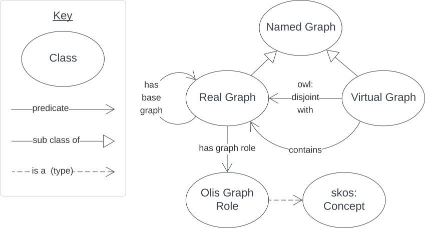
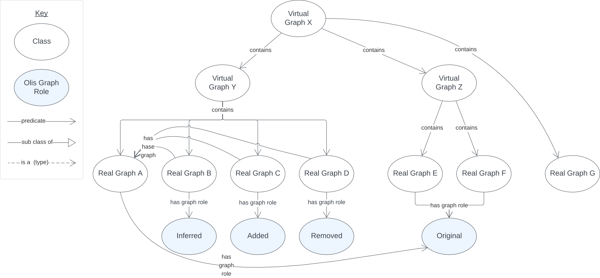

# Olis Ontology

## Overview 

The Oli<span class="rtl">s</span> ontology is a model of virtual and real RDF Named Graphs and relations between them.

It defines only a few classes and a few predicates.



## RDF

The ontology RDF is available [here](assets/olis.ttl){:download="olis.ttl"}.

## Classes

### Named Graph

`https://olis.dev/contains`

An RDF Named Graph, as per [RDF 1.2's definition](https://www.w3.org/TR/rdf12-concepts/#section-rdf-graph).

### Real Graph

`https://olis.dev/contains`

A Named Graph that contains triples.

Example:

```turtle
PREFIX : <https://olis.dev/>
PREFIX ex: <http://example.com>
PREFIX gr: <http://olis.dev/GraphRoles/>
PREFIX schema: <https://schema.org/>

ex:realGraphX
    a :RealGraph ;
    :hasGraphRole gr:Original ;
    schema:name "Real Graph X" ;
    schema:description "A real graph, containing triples about ..." ;
.

ex:realGraphY
    a :RealGraph ;
    :hasGraphRole gr:Inferred ;
    :hasBaseGraph ex:realGraphX ;
    schema:name "Real Graph Y" ;
    schema:description "A real graph, containing triples inferred from Real Graph X" ;
.

ex:virtualGraphZ
    a :VirtualGraph ;
    schema:name "Virtual Graph Z" ;
    schema:description "A Virtual Graph that contains Real Graphs X & Y" ;
    :contains ex:realGraphX , ex:realGraphY ;
.
```

### Virtual Graph

`https://olis.dev/contains`

A Named Graph that does not and cannot contain triples but which may be related to Real Graphs.

## Predicates

### contains

`https://olis.dev/contains`

The subject Virtual Graph contains the object Named Graph.

### has base graph

`https://olis.dev/hasBaseGraph`

The subject Real Graph is derived from, or to be added to, the object Named Graph.

### has graph role

`https://olis.dev/hasGraphRole`

The subject Real Graph plays the object [Olis Graph Role](graph-roles.md).

## Extended Example



In this extended example, the _Virtual Graph X_ _contains_ two other Virtual Graphs and a Real Graph. The contained Virtual Graphs contain other Real Graphs.

_Real Graph A_ is the base graph for _RGs B, C & D_ meaning they are all related.

_Real Graphs E & F_ both have the Olis Graph Role of _Original_ so they are essentially unrelated to one another.

_Real Graph G_ indicates no role so it is assumed to have the default role of _Original_.

```turtle
PREFIX : <https://olis.dev/>
PREFIX ex: <http://example.com>
PREFIX gr: <http://olis.dev/GraphRoles/>
PREFIX schema: <https://schema.org/>

ex:virtualGraphX
    a :RealGraph ;
    :contains 
        ex:virtualGraphY ,
        ex:virtualGraphZ ;
.

ex:virtualGraphY
    a :RealGraph ;
    :contains 
        ex:realGraphA ,
        ex:realGraphB ,
        ex:realGraphC ,
        ex:realGraphD ;
.

ex:virtualGraphZ
    a :RealGraph ;
    :contains 
        ex:realGraphE ,
        ex:realGraphF ,
.

ex:realGraphA
    a :RealGraph ;
    :hasGraphRole gr:Original ;
.

ex:realGraphB
    a :RealGraph ;
    :hasGraphRole gr:Inferred ;
.

ex:realGraphC
    a :RealGraph ;
    :hasGraphRole gr:Added ;
.

ex:realGraphD
    a :RealGraph ;
    :hasGraphRole gr:Removed ;
.

ex:realGraphE
    a :RealGraph ;
    :hasGraphRole gr:Original ;
.

ex:realGraphF
    a :RealGraph ;
    :hasGraphRole gr:Original ;
.

ex:realGraphG
    a :RealGraph ;
.
```